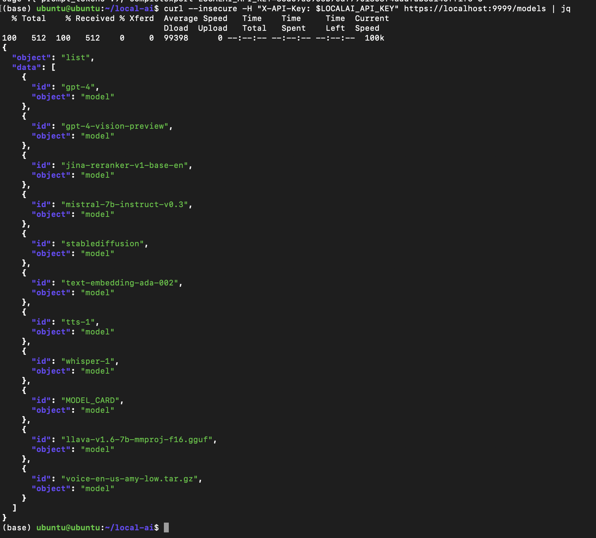
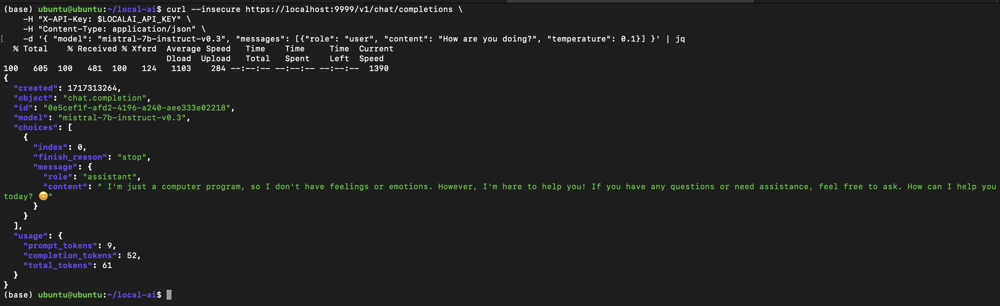
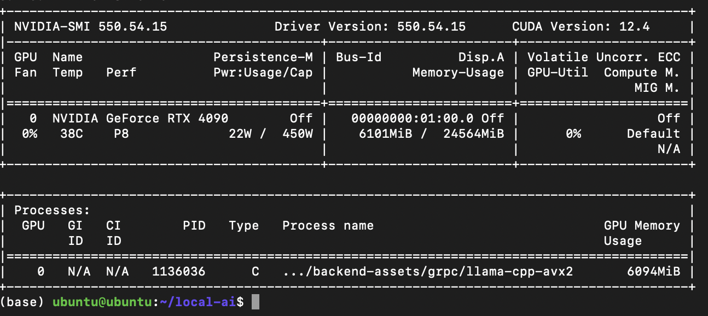

# LocalAI setup
This repo contains an instance of [LocalAI](https://localai.io/) launched using Docker Compose and comprises 2 containers:
1. An Nginx Gateway to perform TLS termination
2. The LocalAI API container to for model inference

See [LocalAI notebook](https://github.com/frenoid/langchain-tutorials/blob/master/00-LocalAI-Test.ipynb) for an example of using `langchain` with a locally hosted LLM.

## Hardware Specifications
The container were run on my personal setup:
* CPU: AMD Ryzen 9 7900X 12-Core Processor
* Memory 64 GiB
* Disk: 1 TB NVMe
* GPU: NVIDIA GeForce RTX 4090 24 GB VRAM

__Note__: A GPU is not strictly neccesary but is about 1 order of magnitude faster than a CPU for Large Language Model Inference
  
## Pre-requisites
These applications must be installed:
1. [Docker](https://docs.docker.com/engine/install/)
2. [Docker Compose](https://docs.docker.com/compose/install/linux/#install-the-plugin-manually)
3. [NVIDIA GPU drivers](https://www.nvidia.com/en-us/drivers/unix/linux-amd64-display-archive/) (GPU only)
4. [NVIDIA Container Toolkit](https://docs.nvidia.com/datacenter/cloud-native/container-toolkit/latest/install-guide.html) (GPU only)

__Note__: Those marked  __(GPU only)__ are only necessary when running inference on a GPU

## Setup

### Create credentials
Prepare a `.env` file. `API_KEY` is used to secure the LocalAI endpoint

The `.env` file should look like this
```toml
API_KEY=<RANDOM_ALPHANUMERIC_STRING>
```

### Generate self-signed certificates
You can use this command to generate self-signed certificates in [nginx/ssl](./nginx/ssl)

Replace the Common Name(CN) and Subject Alternate Name (SAN) as necessary)
```bash
openssl req -x509 -newkey rsa:4096 -sha256 -days 3650 \
  -nodes -keyout nginx/ssl/ca.key -out nginx/ssl/ca.crt -subj "/CN=example.com" \
  -addext "subjectAltName=DNS:example.com,DNS:*.example.com,IP:10.0.0.1"
```

Install the certificate using these commands for Ubuntu
```bash
sudo apt-get install -y ca-certificates
sudo cp nginx/ssl/ca.crt /usr/local/share/ca-certificates
sudo update-ca-certificates
```

### Start 'er up
Start the LocalAI container in detached mode
```bash
docker compose up --detach
```

### Set credentials
If you set `API_KEY` in [docker-compose.yaml](./docker-compose.yaml), to connect to the endpoint, you must set the same for `LOCALAI_API_KEY`
```bash
export LOCALAI_API_KEY="<API_KEY>"
```

### Connect to HTTP endpoint
The server HTTP endpoint will be available at `http://localhost:9998/`

Get list of models
```bash
curl --header "X-API-Key: $LOCALAI_API_KEY" http://localhost:9998/models
```

### Connect to the HTTPS endpoint
The server HTTP endpoint will be available at `https://localhost:9999/`

Get list of models. `--insecure` is needed since we are connecting to `localhost`
```bash
curl --insecure --header "X-API-Key: $LOCALAI_API_KEY" https://localhost:9999/models
```


Try sending in a prompt
```bash
curl --insecure https://localhost:9999/v1/chat/completions \
    -H "X-API-Key: $LOCALAI_API_KEY" \
    -H "Content-Type: application/json" \
    -d '{ "model": "mistral-7b-instruct-v0.3", "messages": [{"role": "user", "content": "How are you doing?", "temperature": 0.1}] }'
```


### Check the GPU usage (if you are using a GPU)
On the first query, the model `mistral-7b-instruct-v0.3` is loaded into memory

View GPU memory consumption using:
```bash
nvidia-smi
```



### Tear down
To shutdown all containers:
```bash
docker compose down
```


